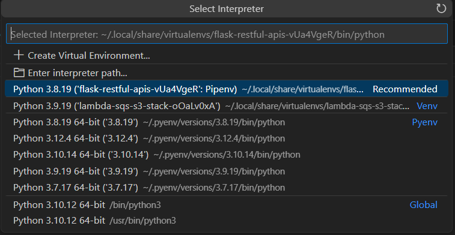
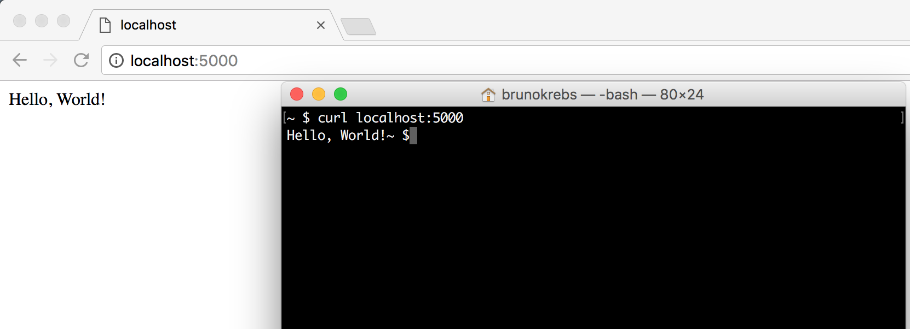
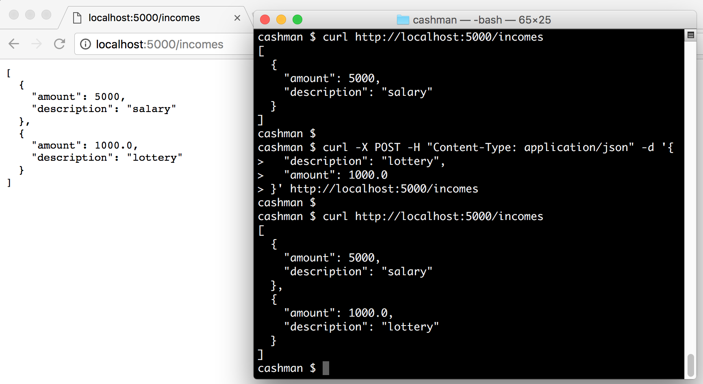

# Developing RESTful APIs with Python and Flask

Let's learn how to develop RESTful APIs with Python and Flask.


# Bootstrapping a Flask Application

We will need to install [Python 3](https://docs.python.org/3/), [Pip (Python Package Index)](https://pypi.python.org/pypi/pip), and [Flask](http://flask.pocoo.org/).

## Installing Python 3

```sh
$ pyenv versions
$ pyenv install --list
$ pyenv install 3.8.19
$ pyenv global 3.8.19
$ python --version
Python 3.8.19
$ python3 --version
Python 3.8.19
```

## Installing Pip

```sh
$ pip --version
pip 23.0.1 from /home/tvt/.pyenv/versions/3.8.19/lib/python3.8/site-packages/pip (python 3.8)
```

You can make sure that pip is up-to-date by running:
```sh
$ python3 -m pip install --upgrade pip
$ python3 -m pip --version
pip 24.1.2 from /home/tvt/.pyenv/versions/3.8.19/lib/python3.8/site-packages/pip (python 3.8)
```

## Virtual environments (virtualenv)

* `pip` as the tool for installing Python packages globally, making it hard to manage multiple versions of the same package on the same machine. It's true that `pip` supports package management through the [requirements.txt](https://pip.pypa.io/en/stable/user_guide/#requirements-files) file
* `requirements.txt`  need all dependencies and sub-dependencies listed explicitly, a manual process that is tedious and error-prone.

We are going to use [Pipenv which is a dependency manager](https://github.com/kennethreitz/pipenv) that isolates projects in private environments, allowing packages to be installed per project

```sh
$ pip install pipenv
$ pipenv --version
pipenv, version 2024.0.1
```

We will use pipenv to start our project and manage our dependencies
```sh
# use pipenv to create a Python 3 (--three) virtualenv for our project
# $ pipenv --three
# $ pipenv install --three
$ pipenv --python 3.8

Creating a virtualenv for this project...
Pipfile: /home/tvt/techspace/python/python-flask-practices/flask-restful-apis/Pipfile
Using /home/tvt/.pyenv/versions/3.8.19/bin/python (3.8.19) to create virtualenv...
⠧ Creating virtual environment...created virtual environment CPython3.8.19.final.0-64 in 1174ms
  creator CPython3Posix(dest=/home/tvt/.local/share/virtualenvs/flask-restful-apis-vUa4VgeR, clear=False, no_vcs_ignore=False, global=False)
  seeder FromAppData(download=False, pip=bundle, setuptools=bundle, wheel=bundle, via=copy, app_data_dir=/home/tvt/.local/share/virtualenv)
    added seed packages: pip==24.1, setuptools==70.1.0, wheel==0.43.0
  activators BashActivator,CShellActivator,FishActivator,NushellActivator,PowerShellActivator,PythonActivator

✔ Successfully created virtual environment!
Virtualenv location: /home/tvt/.local/share/virtualenvs/flask-restful-apis-vUa4VgeR
Creating a Pipfile for this project...
```

Then install Flask app
```sh
# install flask a dependency on our project
$ pipenv install flask
```

Activate the environment
```sh
$ pipenv shell
. /home/tvt/.local/share/virtualenvs/flask-restful-apis-vUa4VgeR/bin/activate
(flask-restful-apis) tvt@TVTLAP:~/flask-restful-apis$ 
```

Create a file named [`hello.py`](./hello.py), in the status bar of VS Code, you need to select right Python interpreter



Add 5 lines of code:
```python
# hello.py
from flask import Flask

app = Flask(__name__)

@app.route("/")
def hello_world():
    return "Hello, World!"
```

To run it, we execute the following command:
```sh
$ flask --app hello run
```

After executing these commands, we can reach our application by opening a browser and navigating to `http://127.0.0.1:5000/` or by issuing `curl http://127.0.0.1:5000/`.
```sh
$ curl http://127.0.0.1:5000/
Hello, World!
```



## Python modules

Similar to Java packages and C# namespaces, [modules in Python](https://docs.python.org/3/tutorial/modules.html) are files organized in directories that other Python scripts can import. To create a module on a Python application, we need to create a folder and add an empty file called `__init__.py`

Let's create our first main module on our application. Let's create the directory `cashman`. The root directory will hold metadata about our project, like dependencies.
```sh
# create source code's root
mkdir cashman && cd cashman

# create an empty __init__.py file
touch __init__.py
```

Inside the main module, let's create a script called [`index.py`](./cashman/index.py). In this script, we will define the first endpoint of our application.
```py
from flask import Flask
app = Flask(__name__)


@app.route("/")
def hello_world():
    return "Hello, World!"
```

Let's create an executable file called [`bootstrap.sh`](./bootstrap.sh) in the root directory of our application.
```sh
# move to the root directory
cd ..

# create the file
touch bootstrap.sh

# make it executable
chmod +x bootstrap.sh
```

The goal of this file is to facilitate the start-up of our application. Its source code will be the following:
```sh
#!/bin/sh
# Defines the main script to be executed by Flask
export FLASK_APP=./cashman/index.py
# Runs our Flask app in the context of the virtual environment listening to all interfaces on the computer (-h 0.0.0.0)
pipenv run flask --debug run -h 0.0.0.0
```

Note: we are setting flask to run in debug mode to enhance our development experience and activate the hot reload feature, so we don't have to restart the server each time we change the code.

Run the script 
```sh
$ ./bootstrap.sh
Courtesy Notice: Pipenv found itself running within a virtual environment, so it will automatically use that environment, instead of creating its own for any project. You can set PIPENV_IGNORE_VIRTUALENVS=1 to force pipenv to ignore that environment and create its own instead. You can set PIPENV_VERBOSITY=-1 to suppress this warning.
 * Serving Flask app './cashman/index.py'
 * Debug mode: on
WARNING: This is a development server. Do not use it in a production deployment. Use a production WSGI server instead.
 * Running on all addresses (0.0.0.0)
 * Running on http://127.0.0.1:5000
 * Running on http://172.29.248.234:5000
Press CTRL+C to quit
 * Restarting with stat
 * Debugger is active!
 * Debugger PIN: 226-427-834
```

Now we can invoke the Hello World endpoint
```sh
$ curl http://127.0.0.1:5000/
Hello, World!
```

We can create another shell script [shutdown.sh](./shutdown.sh) to stop all processes are running on port 5000
```sh
# create the file
touch shutdown.sh

# make it executable
chmod +x shutdown.sh
```

#  Creating a RESTful Endpoint with Flask

The goal of our application is to help users to manage `incomes` and `expenses`. We will begin by defining two endpoints to handle `incomes`. Let's replace the contents of the [`./cashman/index.py`](./cashman/index.py) file with the following:
```python
from flask import Flask, jsonify, request

app = Flask(__name__)

incomes = [
    { 'description': 'salary', 'amount': 5000 }
]


@app.route('/incomes')
def get_incomes():
    return jsonify(incomes)


@app.route('/incomes', methods=['POST'])
def add_income():
    incomes.append(request.get_json())
    return '', 204
```

To interact with both endpoints that we have created, we can start our application and issue some HTTP requests:
```sh
# start the cashman application
./bootstrap.sh &

# get incomes
curl http://localhost:5000/incomes

# add new income
curl -X POST -H "Content-Type: application/json" -d '{
  "description": "lottery",
  "amount": 1000.0
}' http://localhost:5000/incomes

# check if lottery was added
curl localhost:5000/incomes
```



# Mapping Models with Python Classes

For more complex applications that deal with different entities and have multiple business rules and validations, we might need to encapsulate our data into [Python classes](https://docs.python.org/3/tutorial/classes.html).

The first thing that we will do is create a `submodule` to hold all our entities. Let's create a `model` directory inside the `cashman` module and add an empty file called `__init__.py` on it.

```sh
# create model directory inside the cashman module
mkdir -p cashman/model

# initialize it as a module
touch cashman/model/__init__.py
```

## Mapping a Python superclass

We will create three classes in this new module/directory: `Transaction`, `Income`, and `Expense`. The first class will be the base for the two others, and we will call it `Transaction`. Let's create a file called [`transaction.py`](./cashman/model/transaction.py) in the `model` directory with the following code:
```python
import datetime as dt

from marshmallow import Schema, fields


class Transaction(object):
    def __init__(self, description, amount, type):
        self.description = description
        self.amount = amount
        self.created_at = dt.datetime.now()
        self.type = type

    def __repr__(self):
        return '<Transaction(name={self.description!r})>'.format(self=self)


class TransactionSchema(Schema):
    description = fields.Str()
    amount = fields.Number()
    created_at = fields.Date()
    type = fields.Str()
```

[Marshmallow is a popular Python package](https://marshmallow.readthedocs.io/en/latest/) for converting complex datatypes, such as objects, to and from built-in Python datatypes. We can use this package to validate, serialize, and deserialize data. we will use `marshmallow` to serialize and deserialize entities through our endpoints.

```sh
# installing marshmallow as a project dependency
pipenv install marshmallow
```

Besides the `Transaction` class, we also defined a `TransactionSchema` which inherits from another superclass called `Schema`. We will use the latter to deserialize and serialize instances of `Transaction` from and to JSON objects.

## Mapping Income and Expense as Python Classes

We won't expose the `Transaction` class on our endpoints. We will create two specializations to handle the requests: `Income` and `Expense`. Let's make a file called [`income.py`](./cashman/model/income.py) inside the model module with the following code:

```python
from marshmallow import post_load

from .transaction import Transaction, TransactionSchema
from .transaction_type import TransactionType


class Income(Transaction):
    def __init__(self, description, amount):
        super(Income, self).__init__(description, amount, TransactionType.INCOME)

    def __repr__(self):
        return '<Income(name={self.description!r})>'.format(self=self)


class IncomeSchema(TransactionSchema):
    @post_load
    def make_income(self, data, **kwargs):
        return Income(**data)
```

We have the type of transaction value been hardcoded into `INCOME`. This type is a [Python enumerator](https://docs.python.org/3/library/enum.html), which we still have to create, that will help us filter transactions in the future. Let's create another file, called [`transaction_type.py`](./cashman/model/transaction_type.py), inside model to represent this enumerator:

```python
from enum import Enum


class TransactionType(Enum):
    INCOME = "INCOME"
    EXPENSE = "EXPENSE"
```

The code of the enumerator is quite simple. It just defines a class called `TransactionType` that inherits from `Enum` and that defines two types: `INCOME` and `EXPENSE`.

Lastly, let's create the class that represents expenses. To do that, let's add a new file called [`expense.py`](./cashman/model/expense.py) inside `model` with the following code:

```python
from marshmallow import post_load

from .transaction import Transaction, TransactionSchema
from .transaction_type import TransactionType


class Expense(Transaction):
    def __init__(self, description, amount):
        super(Expense, self).__init__(description, -abs(amount), TransactionType.EXPENSE)

    def __repr__(self):
        return '<Expense(name={self.description!r})>'.format(self=self)


class ExpenseSchema(TransactionSchema):
    @post_load
    def make_expense(self, data, **kwargs):
        return Expense(**data)
```

Similar to `Income`, this class hardcodes the type of the transaction, but now it passes `EXPENSE` to the superclass. The difference is that it transforms the given amount to be negative.

# Serializing and Deserializing Objects with Marshmallow

Let's replace [`./cashman/index.py`](./cashman/index.py) contents to:

```python
from flask import Flask, jsonify, request

from cashman.model.expense import Expense, ExpenseSchema
from cashman.model.income import Income, IncomeSchema
from cashman.model.transaction_type import TransactionType

app = Flask(__name__)

transactions = [
    Income('Salary', 5000),
    Income('Dividends', 200),
    Expense('pizza', 50),
    Expense('Rock Concert', 100)
]


@app.route('/incomes')
def get_incomes():
    schema = IncomeSchema(many=True)
    incomes = schema.dump(
        filter(lambda t: t.type == TransactionType.INCOME, transactions)
    )
    return jsonify(incomes)


@app.route('/incomes', methods=['POST'])
def add_income():
    income = IncomeSchema().load(request.get_json())
    transactions.append(income)
    return "", 204


@app.route('/expenses')
def get_expenses():
    schema = ExpenseSchema(many=True)
    expenses = schema.dump(
        filter(lambda t: t.type == TransactionType.EXPENSE, transactions)
    )
    return jsonify(expenses)


@app.route('/expenses', methods=['POST'])
def add_expense():
    expense = ExpenseSchema().load(request.get_json())
    transactions.append(expense)
    return "", 204


if __name__ == "__main__":
    app.run()
```

This finishes the implementation of our API. If we run our Flask application now, we will be able to interact with the endpoints, as shown here:

```sh
# start the application
./bootstrap.sh

# get expenses
curl http://localhost:5000/expenses

# add a new expense
curl -X POST -H "Content-Type: application/json" -d '{
    "amount": 20,
    "description": "lottery ticket"
}' http://localhost:5000/expenses

# get incomes
curl http://localhost:5000/incomes

# add a new income
curl -X POST -H "Content-Type: application/json" -d '{
    "amount": 300.0,
    "description": "loan payment"
}' http://localhost:5000/incomes
```

# Dockerizing Flask Applications

As we are planning to eventually release our API in the cloud, we are going to create a `Dockerfile` to describe what is needed to run the application on a Docker container.

Defining a Docker recipe (`Dockerfile`) will help us run the API in different environments. That is, in the future, we will also install Docker and run our program on environments like `production` and `staging`.

Let's create the `Dockerfile` in the root directory of our project with the following code:

```sh
# Using lightweight alpine image
FROM python:3.8-alpine

# Installing packages
RUN apk update
RUN pip install --no-cache-dir pipenv

# Defining working directory and adding source code
WORKDIR /usr/src/app
COPY Pipfile Pipfile.lock bootstrap.sh ./
COPY cashman ./cashman

# Install API dependencies
RUN pipenv install --system --deploy

# Start app
EXPOSE 5000
ENTRYPOINT ["/usr/src/app/bootstrap.sh"]
```

Please make sure that the Python version in both `Dockerfile` and `Pipfile` are aligned, or the docker container won't be able to start the server.
For our `Dockerfile`, we use Python version 3.8

To create and run a Docker container based on the `Dockerfile` that we created, we can execute the following commands:

```sh
# build the image
docker build -t cashman .

# run a new docker container named cashman
docker run --name cashman \
    -d -p 5000:5000 \
    cashman

# fetch incomes from the dockerized instance
curl http://localhost:5000/incomes

# check logs on docker container
docker ps
docker logs 4a93b5cd7e83

# stop the docker container
docker stop 4a93b5cd7e83
```

The `Dockerfile` is simple but effective, and using it is similarly easy. With these commands and this `Dockerfile`, we can run as many instances of our API as we need with no trouble. It's just a matter of defining another port on the host or even another host.